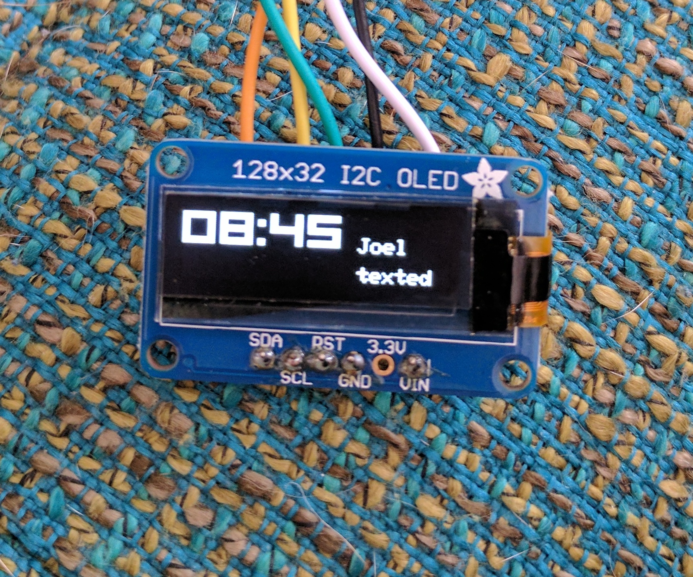

# OpenHAK_SSD130
Custom version of the Adafruit_SSD1306 library for 128x64 and 128x32 OLED displays. 

Original code can be found [here](https://github.com/adafruit/Adafruit_SSD1306). Adafruit sells them [here](https://www.adafruit.com/product/938).  

This library specifically targets the Simblee on the OpenHAK Fitness Tracker

Uses the Wire2 (secret 2nd) I2C bus on the Simblee. Use these pins!  

	 #define OLED_RESET	4
	 #define SCL_PIN    2
	 #define SDA_PIN    3 
	 Wire2.beginOnPins(SCL_PIN, SDA_PIN);

[OpenHAK_128x64_example.ino]():

[OpenHAK_128x32_example.ino]():

[OpenHAK_128x32_Org_01_font.ino]():

